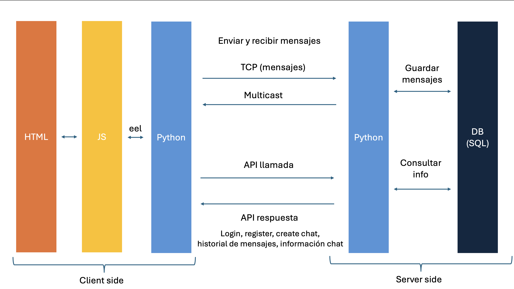

# Práctica final: Implementación de un chat Multicast

Alumno: **Carlos Martín de Argila Lorente** 4A GITT

# Para más información consultar el informe.

## Descripción:

En esta práctica vamos a hacer un chat Multiusuario que se comunique mediante Multicast. 

## Como ejecutar:

Ejecutar desde la carpeta raíz del proyecto el siguiente comando:

**Backend:**
``python backend/main.py``

**Frontend:**
``python frontend/main.py``

### Librerías Python necesarias:
- Eel ``pip install Eel``
- Flask ``pip install Flask``
- Flask-Cors ``pip install Flask-Cors``
- Flask-HTTPAuth ``pip install Flask-HTTPAuth``

## Almacenamiento:

### Información de los usuarios
Para guardar la información de los usuarios se ha creado una base de datos SQL en la que se almacenan los usuarios que se conectan al chat. 

# Información importante:
La aplicacion usa para cada chat un puerto multicast distinto. 

## Funcionamiento:
A continuación se muestra la arquitectura de la aplicación:

Como podemos ver tenemos dos partes distintas: cliente y servidor.

